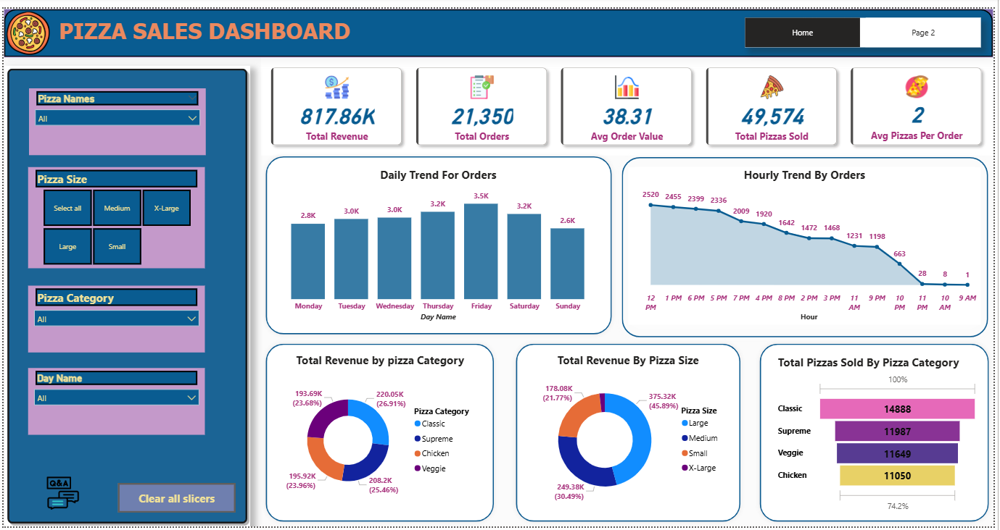

# 🍕 Pizza Sales Analysis Dashboard (Power BI)

## 📌 Overview:
This project is a comprehensive dashboard built using **Power BI** to analyze pizza sales data from **January 2015 to December 2015**. It provides key business insights through dynamic visualizations and KPIs, 
aimed at helping decision-makers understand customer behavior, product performance, and revenue trends.

---

## 🔧 Process & Tools Used:

### 1. Data Loading:
- A **Python script** was created to load the raw sales dataset into a **MySQL** database.
- Proper schema and datatypes were defined for efficient querying.

### 2. Data Preparation:
- SQL queries were written to answer specific business questions (problem statements).
- Queries were optimized to extract KPI metrics and chart values including revenue, orders, time-based trends, and product performance.

### 3. Power BI Dashboard:
- Data was imported into Power BI from the MySQL database.
- A **2-page interactive dashboard** was created:
  - **Home Page**: Focused on high-level KPIs and sales trend visualizations.
    

  - **Page 2**: Detailed breakdowns for best  and wors top 5 selling pizzas by total order,total revenue and total pizzas sold.
  -

- Slicers and filters were added for enhanced interactivity.

### 4. Data Validation:
- SQL query results were cross-verified with Power BI visuals.
- **100% match** confirmed between MySQL results and Power BI outputs.

---

## 📊 KPIs Included:
The dashboard features the following key performance indicators (KPIs):

1. **Total Revenue** – Sum of all order values.
2. **Total Orders** – Number of unique customer orders.
3. **Average Order Value** – Total revenue divided by number of orders.
4. **Total Pizzas Sold** – Sum of all pizzas sold.
5. **Average Pizzas per Order** – Total pizzas sold divided by total orders.

---

## 📈 Charts and Visualizations:
The dashboard includes a wide range of dynamic and insightful charts:

1. **Column Chart – Daily Trend of Orders**  
   - Shows busiest days of the week based on order frequency.

2. **Area Chart – Hourly Trend of Orders**  
   - Visualizes peak hours throughout the day.

3. **Donut Chart – Total Revenue by Pizza Category**  
   - Distribution of revenue among different pizza categories (e.g., Classic, Veggie, Chicken).

4. **Donut Chart – Total Revenue by Pizza Size**  
   - Breakdown of revenue based on pizza size (S, M, L, XL).

5. **Funnel Chart – Total Pizzas Sold by Category**  
   - Highlights the volume of pizzas sold per category in descending order.

6. **Bar Charts – Best & Worst Selling Pizzas**  
   - **By Total Revenue**
   - **By Total Orders**
   - **By Total Pizzas Sold**

---

## 🛠 Technologies Used:
- **Python** (for data ingestion)
- **MySQL** (data storage and querying)
- **Power BI** (dashboard creation and visualization)

---
## Developed by:
 **Vaibhav Malavi**

---

